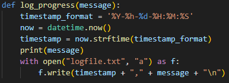
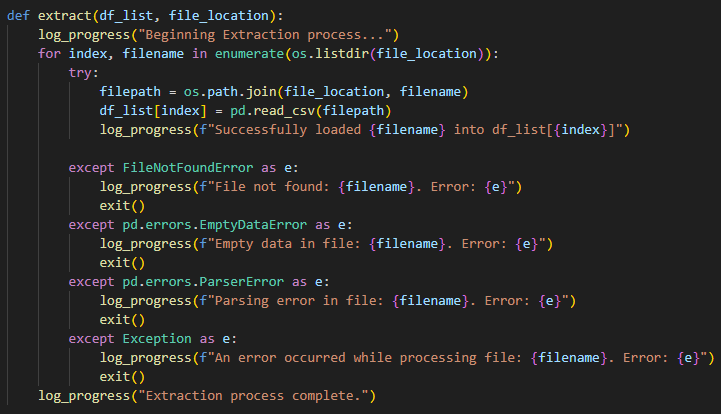
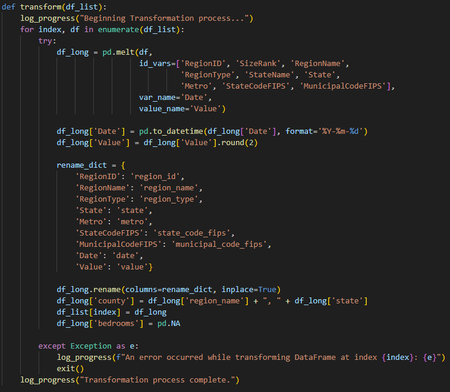

# Zillow Real Estate Project

## Overview
This project processes and loads real estate data from Zillow into a PostgreSQL database.

## Setup
1. Clone the repository
2. Set up virtual enviornment and install dependencies 
3. Modify db_config.txt file to your PostgreSQL credentials
4. Run ETL.py

## Purpose
I wanted to create a Power BI dashboard that would allow me to take a deep look at how property values
have evolved over the years. All of the data that was used in this project was obtained from Zillow's
Home Value Index (ZHVI):

https://www.zillow.com/research/data/

According to Zillow, the data in these .csv files reflect the "typical home value and market changes
across a given region and housing type." Each of these are seperated into a document based on the number
of bedrooms in each home. The documents also provide data and metrics for all counties in all states from
2000 until 2024.

However, in it's current format this data is too unorganized, contains unecessary information, and is 
seperated into five different .csv files according to how many bedrooms the homes have (one through five+ bedrooms).
In order to remedy this I first sought to create an ETL script in Python.

## Python 
My script will be using Pandas for data extraction and manipulation, Seaborn to identify null values, and 
SQLAlchemy to create an engine and commit data to my PostgreSQL database.

Here is the main method to give an overview of what this ETL script is doing

First, I created a log method to track progress and identify any errors

Next, I extracted all of the .csv data into a list of Pandas dataframes

Now I want to use Pandas to melt the data frames into as few columns as possible. This will ensure
that a date, county, and number of bedrooms combination can be used as a primary key to retrieve 
an average property value.

