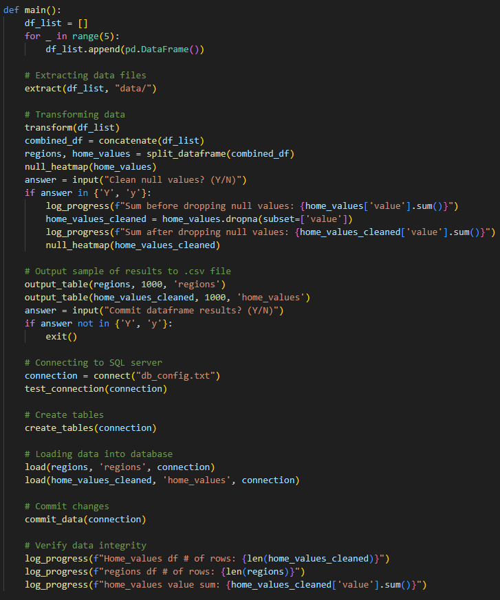
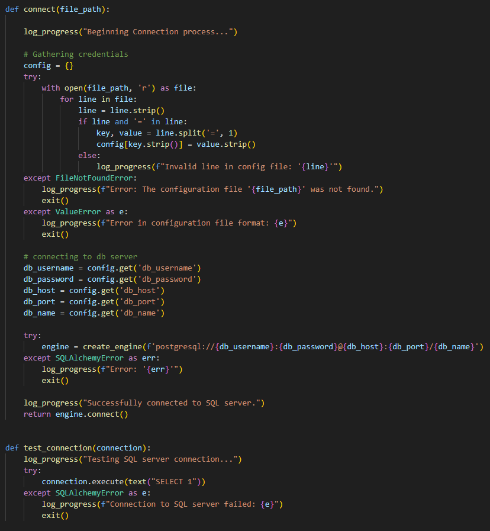
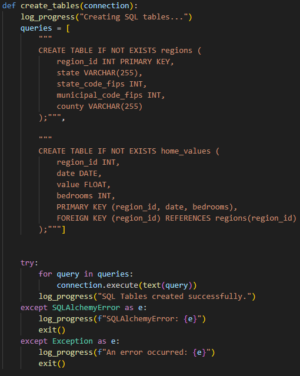
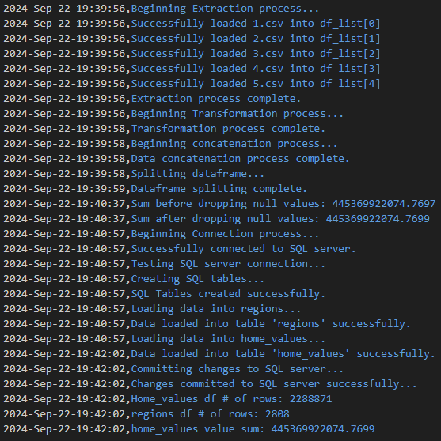
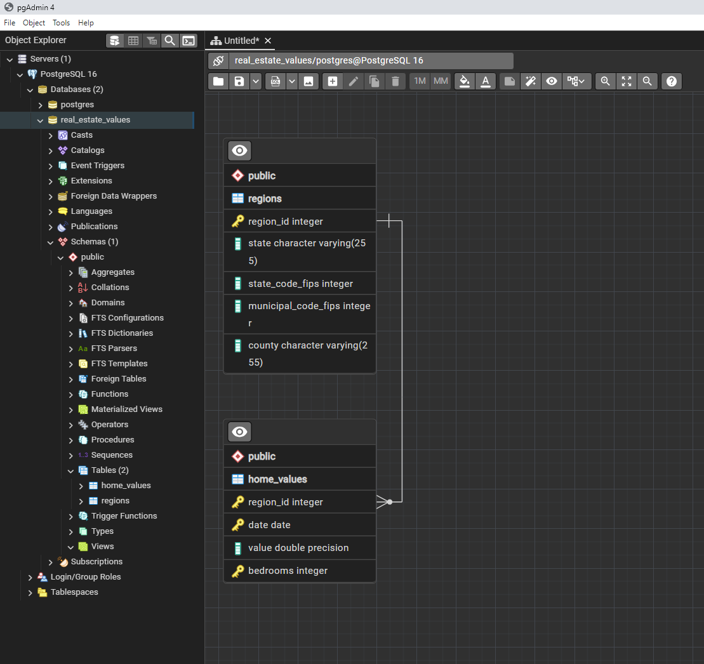
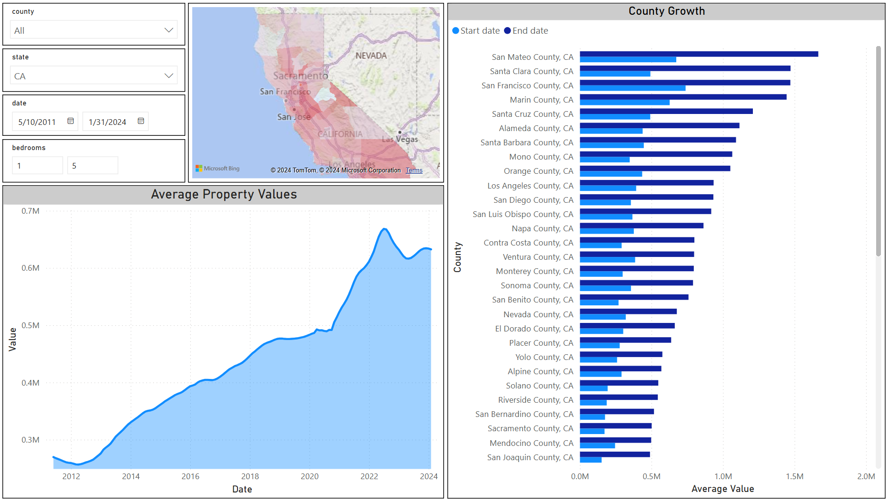

# Zillow Real Estate Project

## Overview
This project processes and loads real estate data from Zillow into a PostgreSQL database.

## Setup
1. Clone the repository
2. Set up virtual enviornment and install dependencies 
3. Modify db_config.txt file to your PostgreSQL credentials
4. Run ETL.py

## Purpose
I wanted to create a Power BI dashboard that would allow me to take a deep look at how property values
have evolved over the years. All of the data that was used in this project was obtained from Zillow's
Home Value Index (ZHVI):

https://www.zillow.com/research/data/

According to Zillow, the data in these .csv files reflect the "typical home value and market changes
across a given region and housing type." Each of these are seperated into a document based on the number
of bedrooms in each home. The documents also provide data and metrics for all counties in all states from
2000 until 2024.

However, in it's current format this data is too unorganized, contains unecessary information, and is 
seperated into five different .csv files according to how many bedrooms the homes have (one through five+ bedrooms).
In order to remedy this I first sought to create an ETL script in Python.

## Python 
My script will be using Pandas for data extraction and manipulation, Seaborn to identify null values, and 
SQLAlchemy to create an engine and commit data to my PostgreSQL database.

Here is the main method to give an overview of what this ETL script is doing

First, I created a log method to track progress and identify any errors

Next, I extracted all of the .csv data into a list of Pandas dataframes

Now I want to use Pandas to melt the data frames into as few columns as possible. This will ensure
that a date, county, and number of bedrooms combination can be used as a primary key to retrieve 
an average property value.

Next, I need to concatenate all of the dataframes from my list into one dataframe, and assign a value
to indicate how many bedrooms are in the home. Once that is finished I will split this final dataframe,
based on the columns so that they will both match the final tables I will be creating in PostgreSQL.

With the data now more organized I am going to use the Seaborn module to identify where null values are present in my
data and the Matplotlib module to visualize them.

Now with Pandas I can remove all rows which have a null value where a property value should be. 
Checking this visually I can see it was succesful.

Now that my data has been transformed into a suitable format and properly cleaned I want to connect to my PostgreSQL 
database using the SQLAlchemy module. With this code I will connect using my credentials and then test the connection 
to confirm it is working.

With my SQLAlchemy engine I can now execute an SQL query directly from my script and create the necessary 
tables in the database.

Finally, I will use my engine to load and commit all of my data into the newly created tables in my database. 

Checking the log file I can see that everything was successful.

Now that my ETL script is complete I can go to my PostgreSQL database and confirm that the tables were created
successfully and my data is loaded.

## Power Bi

The last step in this process is to connect my database to Power Bi and upload the data. I want part of my 
dashboard to give me an accurate property value growth over a time period which the user can specify. In order
to achieve this I can use DAX scripts to create a measure that will calculate this growth.

Using this script as well as the data from my database I can now create a dashboard to give accurate information.
This dashboard allows for the user to specify whether they want data based on state, county, timeframe, as well as
number of bedrooms in the home. Using this criteria it will provide the following data:

1. A heatmap that uses the DAX script to highlight which counties in the selected state have seen the most growth
2. A county growth chart showing which counties have the highest property value.
3. A line chart displaying the average property values.

